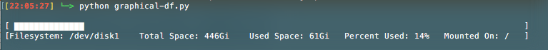

# graphical-df
A naive terminal based graphical implementation of "df -hl" in python.
Only the primary local filesystems (usually main disks) are displayed.

Sometimes you just need a graphical implementation of df.

## Run

1. Run `$ python graphical-df.py`. 

## Screenshot

## To Do

* Test against other versions of *nix
